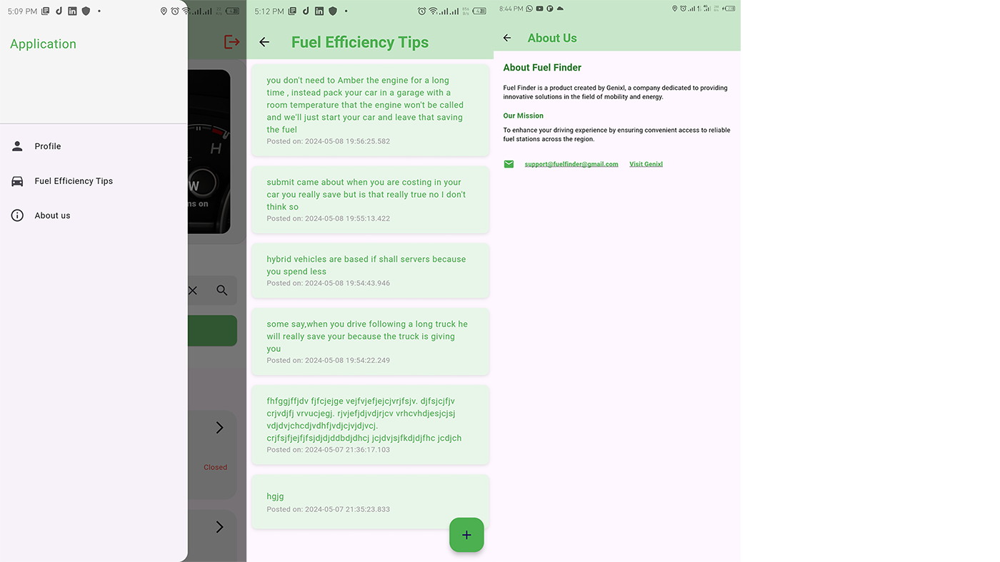
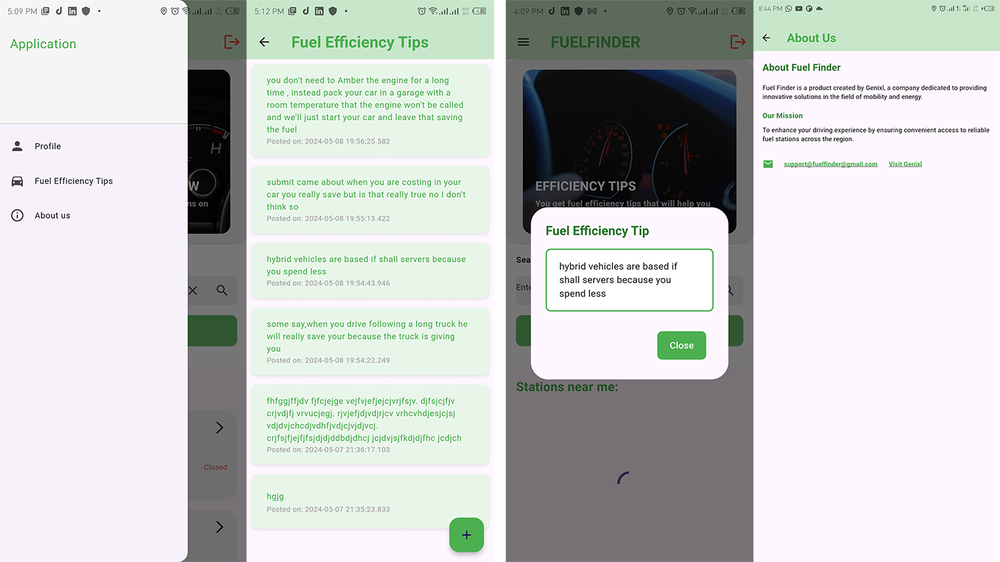
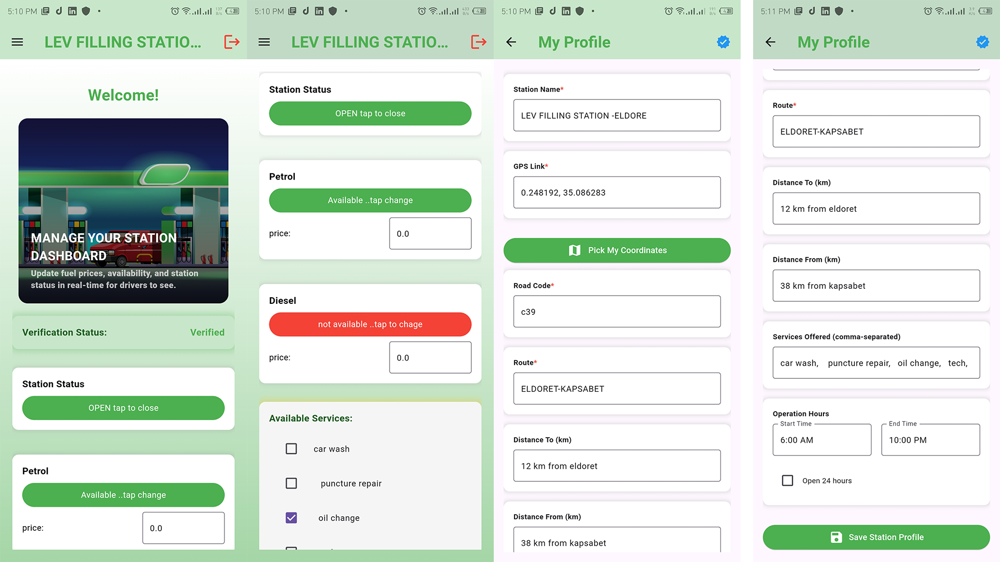
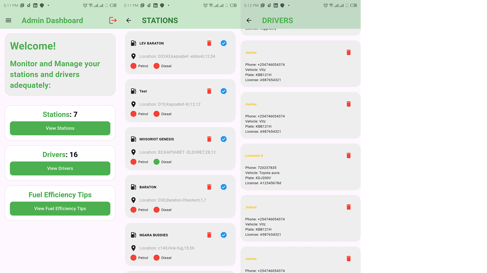

# FUELFINDER

## Introduction
FUELFINDER is a mobile application designed to address the problem of fuel shortages, particularly in rural areas and stations far from cities. It allows drivers to locate available fuel stations and track fuel availability in real-time. The application is built using the Flutter framework and written in Dart language.

## System Architecture
The application consists of three main dashboards:
1. Driver Dashboard
2. Admin Dashboard
3. Station Dashboard

## Authentication

### Login Page
When opening the application for the first time, users are presented with a login page. This page includes:
- A carousel displaying basic information about the application
- Login fields for email and password.

### Signup Page
New users can create an account by providing:
- Email
- Password
- Role selection (driver or station)

After signup, the user's role is saved in the system.and the system will always remember it when the user is logging in by checking the role that matches with the email adress the user is logging in with.

### Role based Navigation
Upon successful login, the system checks the user's role (driver, station, or admin) and navigates them to the appropriate dashboard. The admin role is assigned directly from the database to a single user.

### Profile Completion
Before the dashboard loads completely, the system checks if the user's profile is complete. If not, a dialog prompts the user to complete their profile. Once completed, the user is automatically navigated to their dashboard.

For the stations after completing their registration they will wait for 24 hours inorder for theit profiles to be verified by the admins,so that they can nteract with the system.Verification will ensure that no one can just register a station and the driver sees it.Also unverified stations are not visible on the drivers side this will ensure integrity.

### State Persistence
The system maintains the state of the user's dashboard, eliminating the need for repeated logins.

## Driver Dashboard

### Main Components
1. Fuel efficiency tips
2. Search function
3. Map view
4. List of fuel stations

### Profile Page
Allows drivers to input and edit:
- Contact details
- Vehicle name and model

### Search Feature
Allows drivers to search for routes or fuel station names within their region.

### Nearby Stations
- Displays fuel stations within a 30 km radius
- Sorted by nearest distance
- Shows station name, distance, fuel availability, and status
- Color-coded fuel availability (red for unavailable, green for available)
- Displays operation hours and 24hour availability

### Station Details Page
Accessible by tapping on a station, showing:
- Location information
- Fuel status
- Fuel prices
- Available services

### Map View Page
- Centred on the driver's real-time location
- Displays all registered stations as markers
- you can zoom to navigate to the area you want on the map and you will be able to view the stations that are within the region you are looking for.
- the stations that are displayed on the map that when you tap at one of them you will be able to see the status of that station.
- You can also search for the area you want to vies and the map wil lbe able to show you that area like how it is doen in the conventinal maps.
- as you drive arround your realtime location will be centered in the map and it is marked by car icon ensuring that you always have a view of the fuel station.

## Station Dashboard
This is the page for all the stations that have registered to the system,it is where they are able to update their status and manage all the services within their statiions.
note that the verified stations can interact with their dashboard and change the status ans well as their profiles.

when a non verified station attempts to change the status he will not be able to and a dislog will show him that he eeds to be verified in oder to perform the operation.this is usually performed by admin 24 hours after the registation of the station.

### Main Components
1. Information carousel
2. Verification status panel
3. Station status toggle (open/closed)
4. Fuel availability panels for petrol and diesel
5. Fuel price settings
6. Available services checklist

### Station Profile
Allows station managers to edit:
- Station name
- Location
- Operation hours
- Available services and other fields required by the sytem ,the system higlight the important fields which mist be filled.

### GPS Coordinates
- GPS link field for station coordinates
- Integrated map for easy coordinate selection,to select your coodinated just tap pick my coordinates button below gps link field,this will open a map,the manager can now look for his location and search for his location,zoom to where he is sure it is the location of their station and tap on that location,the system will automatically pick the coordinated and navigates back to profile page and autofill the coordinates to the gps link field.(also these coordinates will be inthe clipboard for convenience).

## Admin Dashboard

### Main Features
1. Display of total number of fuel stations and drivers
2. Fuel efficiency tips management
3. User management (stations and drivers)

### Station Verification Process
- 24hour system check for new station registrations
- Admin notifications for pending verifications
- Verification button for each station
- Research process to detect fake stations
- Option to delete fake or invalid stations

### User Management
Admins can view all registered users and perform actions such as:
- Deleting users
- Verifying stations

### Fuel Efficiency Tips
- Feature to display fuel saving tips for drivers
- Ability for drivers or admins to create new efficiency tips

## Database and Backend
The system utilizes Firebase, a Google service, for:
- Backend operations
- User authentication
- Project management
- Resource management

Firebase was chosen for its speed, efficiency, and ease of use, providing all necessary features for the application.

## DATABASE AND BACKEND

### Backend System: Firebase
For our app's backend, we're using Firebase. It's a service from Google that helps us interact with our database, handle user logins, and manage our project resources. We picked Firebase because it's fast, efficient, and easy to use. It gives us all the features we need without much hassle.

### DATABASE: Cloud Firestore
Our database is Cloud Firestore, which is a type of database called NoSQL. In Firestore, we organize our data into "collections" instead of traditional tables.

#### Main Collections:
1. Users Collection:
    - Stores information about all our users
    - this includes the details for the users capturing emails their id and their roles as either driver station or admin.

2. Fuel Stations Collection:
    - Contains all the information about different fuel stations
    - Includes things like station names, locations, and contact details

3. Station Services Collection:
    - Keeps track of what services each fuel station offers
    - Updates in real-time, so users always see the latest information
    - this also include a checkmark for updated services that are currenly      available for that station.
    - the station services are linked to each station that offers those particular services

4. Drivers Collection:
    - Stores details about drivers who use our app
    - Includes driver profiles with information like vehicle types or preferred fuel stations.

5. Fuel Efficiency Tips Collection:
    - A collection of helpful tips for users to save fuel
    - Might include advice on driving habits, vehicle maintenance, etc.

#### Database Rules:
We can set different rules for each collection. This helps us control who can read or change the data, keeping everything secure.

#### Interacting with the Database:
To work with our database, we created a special class called the Firestore Service class. This class has all the methods (functions) we need to:
- Create new collections
- Add new data to collections
- Get data from collections
- Filter data based on what we're looking for
- Stream data for real-time updates

## MODELS
We've also made classes that define the structure for each type of data we store. These are called models. For example, we have a user model that says what information we keep about each user, a Fuel Station model for station details, and so on. This helps keep our data organized and consistent.

## AUTHENTICATION SERVICE
To handle user logins, we're using Firebase Authentication. We made a special class to manage all the login stuff. Right now, users can sign up and log in using their email and password. This class takes care of:
- Creating new user accounts
- Logging users in
- Logging users out
- Checking if a user is currently logged in

## MAPS SERVICE
For showing maps in our app, we're using a service called Mapbox. It's based on OpenStreetMap and is pretty easy to use. One cool thing about Mapbox is that we can change how our maps look using their Map Studio tool on their website. This lets us make the maps match our app's style.

## REALTIME OPERATIONS
A big feature of our app is that it updates in real-time. This means when something changes in our database, the app updates right away without the user having to refresh or restart.

### How it works:
1. We set up "streams" in our Firestore Service class.
2. These streams constantly listen for any changes in our database collections.
3. When a change happens (like a fuel station updates its services), the stream notices.
4. The app then automatically updates to show the new information.
5. Users see these updates instantly, keeping everything current.

This real-time feature is super helpful for things like fuel prices or station availability. Users always see the most up-to-date info without doing anything extra.

By using Firebase, Cloud Firestore, and these real-time features, we've built an app that's fast, reliable, and always up-to-date. It gives our users the latest information about fuel stations, making their experience smooth and helpful.